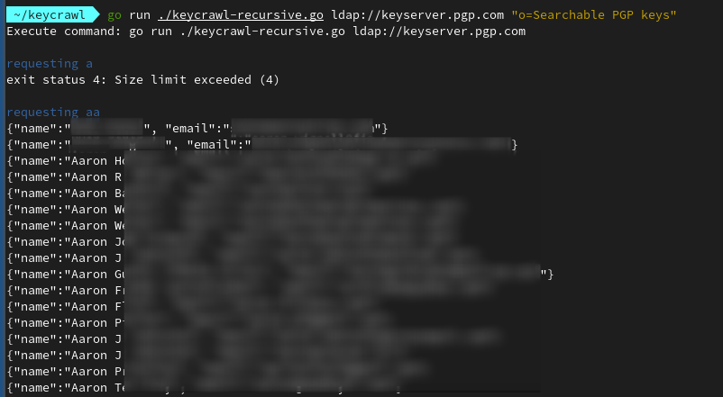

# Keycrawler

On phishing simulation engagements sometimes you want to parse PGP keyservers that your target company provides. That way you get a pretty good list of recipients for your address list.

In my case the server offered only ldap(s) and the number of returned items was limited to 5 PGP keys. So to say I also could only get five addresses without filtering.

## Methodology
**Keycrawler** recursively requests `pgpUserID` with filters like the following:

`a*` returns 2 matches -> print and return
`b*` returns too many matches -> 
    `ba*` returns two e-mail addresses
    `bb*` returns no e-mail address
    ... and so on until `bz*`
`c*` ...

To be exact. The search area is `abcdefghijklmnopqrstuvwxyz.-_ (` in order to find also pgpuserIDs incorrectly formatted with spaces or starting with parentheses.

This approach will narrow down the naming scheme so far that the number of result fits into your allowed response size automatically. I tested this with a server that was limited to five results.

## Usage

In order to use the tool you'll have to find out the base of the ldapserver:
```bash
LDAPTLS_REQCERT=never ldapsearch -x -H 'ldap://keyserver.pgp.com'  -s base +

output:
namingContexts: o=Searchable PGP keys
namingContexts: o=Uploaded PGP keys
namingContexts: o=Users
namingContexts: o=Prefs
namingContexts: o=CRL
namingContexts: cn=PGPServerInfo
namingContexts: o=PGP keys
```

Now you can use the host as first argument and the naming context second argument to pass the base.

```bash
go run ./keycrawl-recursive.go ldap://keyserver.pgp.com "o=Searchable PGP keys"
```



I split result output to stdout and all info level stuff to stderr. That way you can redirect just the results to a file.

```bash
go run ./keycrawl-recursive.go ldap://keyserver.pgp.com "o=Searchable PGP keys" 1>data.json

# Parse the output with jq
<data.json jq -r .email
```

Interrupting the program at any time will show you the number of e-mails gathered as well as the total request count. This was mostly to demonstrate "hey, with just five requests I can get 200 of your e-mail addresses easily!".

## Disclaimer
The tool is provided as is. It was a short hobby project beside my work. Feel free to implement and PR the following:

* [ ] Proper output handling and coloring
* [ ] Flags
* [ ] manpage or `--help`